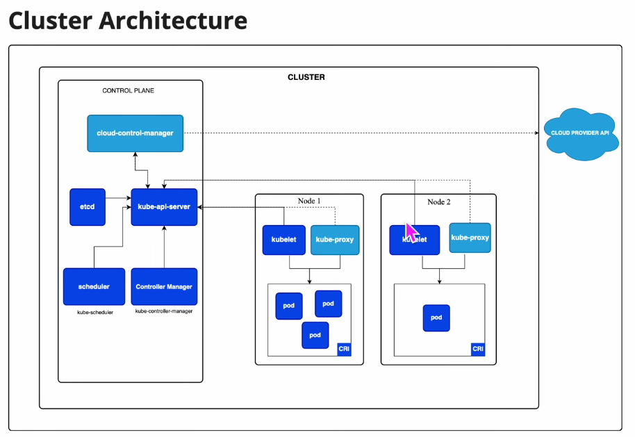

# Kubectl Cheat Sheet (Minikube)

## 4. Cluster Architecture



- Trong 1 cluster của k8s gồm 2 thành phần chính:
  - Thành phần thứ nhất là: Control Plan / Master Node
  - Thành phần thứ hai là: Worker node 1, Worker node 2 / Data Plan
- Ứng dụng của mình về mặt kỹ thuật có thể deploy lên cả Master Node lẫn Worker Node
- Nhưng thông thường best practice thì deploy ứng dụng lên Worker Node

- Trên Master Node có 1 thành phần ETCD là một database cơ sở dữ liệu dạng key/value
- Trên control plan có một thành phần là Api-Server (api-server sẽ nhận yêu cầu từ quản trị viên)
- Api Server đi hỏi Schedule, Schedule xem ETCD để xem con Worker node nào phù hợp nhất để triển khai.
- Trên Worker Node có tác nhân để nhận yêu cầu là Kubelet
- Trong control plan có thêm tác nhân Controller Manager làm nhiệm vụ quản lý baseline, giám sát các replicaset của các Worker Node
- Trong control plan có thêm 1 thành phần nữa là Container runtime. Và ở các Worker node cũng đều có Container runtime
- Để nói chuyện giữa Api Server và các Worker Node thì có 1 dịch vụ để nói chuyện là Kube-proxy

## 0. Kiểm tra version

``` bash
# Kiểm tra version của k8s
kubectl version --client

# Kiểm tra version của minikube
minikube version

# Khởi động Minikube
minikube start

# Kiểm tra trạng thái
minikube status

# Xem danh sách namespaces
kubectl get namespaces # hoặc viết tắt kubectl get ns

# Tạo namespace dev
kubectl create namespace dev

# Tạo Pod trong namespace dev
kubectl run nginx-dev --image=nginx -n dev

# Xem các tài nguyên trong namespace dev
kubectl get pods -n dev

# Đổi Namespace mặc định cho ngữ cảnh (Context)
kubectl config set-context --current --namespace=dev

# Xóa Namespace
kubectl delete namespace dev

# Xem pod với tất cả namespace
kubectl get pods -A # Hoặc: kubectl get po -A

# Xem node
kubectl get nodes

# Xem pod với namespace mặc định
kubectl get pods # Hoặc: kubectl get po

# Chạy 1 pod với tên là app1 và image là image trên dockerhub, vietaws/eks (ubuntu), vietaws/arm (macos chip M)
kubectl run app1 --image=vietaws/eks:v1

# Để xóa pod app1 vừa tạo
kubectl delete pod app1 # Hoặc: kubectl delete pod app1 --force --grace-period=0 (Xóa ngay lập tức không chờ grace period). Vì mặc định k8s đợi khoảng 30s để pod đóng kết nối an toàn.

# Monitor trạng thái pods chạy
kubectl get pods --watch # Hoặc: kubectl get pods -w

# Xem thông tin của pods
kubectl describe pods app1

# Trong trường hợp mình update version ở trên dockerhub thì khi chạy một cái image thì mình phải thêm '--image-pull-policy Always'
kubectl run app2 --image=vietaws/eks:v1 --image-pull-policy Always

# Có 2 cách để expose port của pods ra bên ngoài: NodePort và LoadBalancer. LoadBalancer dùng trong công cụ cloud provider ELP, còn NodePort thì expose dạng node theo dải port 30,000 -> 32,767 (random)

# Để muốn gọi từ ứng dụng bên ngoài vào trong nội bộ cluster thì phải tạo 1 cái service (svc)
kubectl get services # Hoặc kubectl get svc

# Muốn expose ra bên ngoài thì dùng
kubectl expose --help
kubectl expose service nginx --port=443 --target-port=8443 --name=nginx-https
kubectl expose pods app1 --port=8081 --target-port=8080 --name=service1 --type=NodePort
kubectl get svc

# Xem thông tin chi tiết của một cái port
kubectl describe svc service1
kubectl get svc
kubectl get nodes
kubectl get nodes -o wide # Xem thông tin chi tiết

# Expose port ra bên ngoài (minikube)
minikube service service1 --url

kubectl describe pods app1
kubectl get svc

# Xem log của pods
kubectl logs app1
kubectl logs app1 -f

# Trong trường hợp 1 pod có nhiều container thì phải dùng cú pháp khác
kubectl logs app1 -c app1 log1 -f

# Kiểm thử chui vào pods và container (exec)
kubectl exec -it app1 -- ls
kubectl exec -it app1 -- cat index.js
kubectl exec -it app1 -- sh

# Imperative vs Declarative (Imperative là gõ từng lệnh 1, Declarative dùng file yml)
kubectl apply -f pod.yml
kubectl get pods -w
kubectl describe pods simple-app

# ReplicaSet: Định nghĩa tôi muốn chạy 1 nhóm các con pod, với số lượng là replicas: 3
kubectl get pods
kubectl get replicasets.apps # Hoặc kubectl get rs

kubectl apply -f replicaset-rs.yml
kubectl get rs
kubectl delete -f replicaset-rs.yml # Hoặc kubectl delete rs rs3
kubectl get po

kubectl describe replicasets.apps rs3
kubectl describe rs rs3

kubectl get pods
kubectl delete pod rs3-nhgjq # Sau khi xóa 1 pod thì tự động tạo 1 con pod mới

kubectl get svc
kubectl get rs
kubectl delete rs rs3

# ReplicaSet: Hiểu rõ cách dùng selector
kubectl run app3-manual --image=vietaws/eks:v3 --labels="app=app3,env=prod"
kubectl get pods
kubectl describe pods app3-manual
kubectl apply -f replicaset-rs.yml
kubectl get rs
kubectl get pods

# Expose ReplicaSet Imperative
kubectl get pods
kubectl get rs
kubectl get svc
kubectl expose rs rs3 --name=service3 --type=NodePort --port=8080
kubectl get svc
kubectl get nodes -o wide
minikube service service3 --url

# Expose ReplicaSet Declarative
kubectl get svc
kubectl apply -f nodeport.yml
kubectl get svc
minikube service service3-declarative --url
kubectl get pods

# Edit ReplicaSet và Giới Thiệu Deployment
kubectl get svc
kubectl edit rs rs3 # thay đổi image:v3 -> image:v4 thì phải xóa pods cũ đi, còn thay đổi replica 3 -> 4 thì không cần xóa
kubectl get po

kubectl get pods
kubectl delete pods rs3-9rks9 rs3-pknww rs3-w8zrv app3-manual
kubectl get pods
kubectl describe pods rs3-4gt82
kubectl get svc
minikube service service3-declarative --url

# Create Deployment Imperative
kubectl delete rs rs3
kubectl get rs
kubectl get pods
kubectl delete pod app1 simple-app
kubectl get pods
kubectl get svc
kubectl delete svc service1 service3 service3-declarative
kubectl get svc

kubectl create deployment --help
kubectl create deploy app1-deploy --image vietaws/eks:v1 --port 8080 # Hoặc kubectl create deployment app1-deploy --image vietaws/eks:v1 --port 8080
kubectl get deployment
kubectl get svc
kubectl get rs
kubectl get pods
kubectl describe pod app1-deploy-9686c96f9-qrh5c

# Create Deployment Declarative
kubectl apply -f deploy1.yml
kubectl get pods
kubectl get rs
kubectl get deploy
kubectl describe deployment nginx-deployment
kubectl get deployment
kubectl get svc
kubectl get rs
kubectl expose deployment app1-deploy --type=NodePort --port=8080 --target-port=8080
kubectl get svc
kubectl expose deployment nginx-deployment --type=NodePort --port=8081 --target-port=8080
kubectl get svc
minikube service app1-deploy --url
minikube service nginx-deployment --url

# Scale & Expose Deployment Dưới Dạng NodePort
kubectl scale --replicas=2 deployment nginx-deployment
kubectl expose deployment nginx-deployment --port=8080 --name=svc1 --type=NodePort
kubectl get svc
minikube service svc1 --url

# Set Container Image on Deployment K8s
kubectl apply -f deploy1.yml
kubectl edit deployment nginx-deployment # Sửa replicas từ 3 -> 4
kubectl get po # -> ok lên 4 replicas
# giờ muốn đổi image từ v1 -> v2
kubectl set image --help
kubectl set image deployment nginx-deployment --help
kubectl set image deployment nginx-deployment simple-app=vietaws/arm:v3

# Rollout Deployment Kubernetes
kubectl apply -f deploy1.yml
kubectl set image deployment nginx-deployment simple-app=vietaws/arm:v3
kubectl rollout history --help
kubectl rollout history deployment nginx-deployment
kubectl rollout status deployment nginx-deployment
kubectl edit deployments.apps nginx-deployment # sửa v3 -> v4
kubectl get po -w

# Rollback Deployment Kubernetes
kubectl apply -f deploy1.yml
kubectl set image deployment nginx-deployment simple-app=vietaws/arm:v3
kubectl set image deployment nginx-deployment simple-app=vietaws/arm:v4
kubectl rollout history --help
kubectl rollout history deployment nginx-deployment --revision=1
kubectl rollout undo deployment nginx-deployment
kubectl rollout undo deployment nginx-deployment --to-revision=3

# Pause & Resume Deployment
kubectl set resources --help
kubectl rollout pause --help
kubectl rollout pause deployment nginx-deployment
kubectl set image deployment nginx-deployment simple-app=vietaws/arm:v3
kubectl set resources deployment nginx-deployment -c=simple-app --limits=cpu=200m,memory=512Mi # không chạy vì đang bị pause
kubectl rollout resume deployment nginx-deployment
kubectl get po
kubectl describe deployment nginx-deployment

# Change Cause on Deployment Revision
kubectl apply -f deploy1.yml
kubectl annotate deployment nginx-deployment kubernetes.io/change-cause="image updated to vietaws/arm:v4"
kubectl edit deployment nginx-deployment
kubectl rollout history deployment nginx-deployment

# Recreate vs RollingUpdate Deployment Strategies
kubectl apply -f deploy1.yml
kubectl edit deployment nginx-deployment
# Sửa type Strategies từ RollingUpdate -> Recreate
# strategy:
#   type: Recreate
kubectl get po -w

# Progress Deadline Seconds
progressDeadlineSeconds: 200

# Restart Deployment
kubectl apply -f deploy1.yml
kubectl rollout restart deployment nginx-deployment

# Services | ClusterIP vs NodePort vs LoadBalancer vs ExternalName | Kubernetes
kubectl api-resources | grep services
kubectl apply -f clusterip.yml
kubectl get svc
kubectl run pod1 --image=vietaws/eks:v1 --port=8080 -l="app=app1,env=demo"
kubectl describe po pod1
kubectl get svc
kubectl describe svc clusterip-svc
kubectl get po -o wide
kubectl run pod2 --image=vietaws/eks:v1 --port=8080 -l="app=app1,env=demo"
kubectl describe svc clusterip-svc # Endpoints: 10.244.0.15:8080,10.244.0.16:8080
kubectl delete po pod2
kubectl exec -it pod1 -- sh
ifconfig
nslookup clusterip-svc
exit
kubectl get svc
kubectl apply -f loadbalancer.yml
kubectl get svc

# Namespace
kubectl describe po pod1
kubectl api-resources | grep namespace
kubectl get ns
kubectl get po -A
kubectl get po -n default
kubectl get po -n kube-system
kubectl create namespace dev
kubectl get ns
kubectl run pod1 --image=vietaws/eks:v1 --port=8080 -n dev
kubectl get po -n dev
kubectl get po -n default
kubectl describe po pod1 -n dev
kubectl get po -o wide -n dev
kubectl exec -it pod1 -n dev -- sh
curl 10.244.0.122
kubectl api-resources | grep pod
kubectl api-resources | grep services
kubectl api-resources | grep pv
kubectl get svc -A

# Curl Pod
kubectl apply -f curl.yml
kubectl get po
kubectl exec -it curl-pod -- sh
curl simplize.vn
curl nodeport-svc.ns1.svc.cluster.local:8080
```

## 1. Minikube

``` bash
# Khởi động Minikube
minikube start

# Kiểm tra trạng thái
minikube status

# Dừng Minikube
minikube stop

# Xóa cluster
minikube delete

# Dashboard
minikube dashboard
```

## 2. Cluster

``` bash
# Xem thông tin cluster
kubectl cluster-info

# Kiểm tra version
kubectl version

# Xem context hiện tại
kubectl config current-context

# Xem các context
kubectl config get-contexts

# Chuyển context
kubectl config use-context minikube
```

## 3. Namespace

``` bash
# Xem namespace
kubectl get namespaces # Hoặc: kubectl get ns

# Tạo namespace
kubectl create namespace dev

# Xóa namespace
kubectl delete namespace dev

# Chạy lệnh trên namespace cụ thể
kubectl get pods -n dev

# Đặt namespace mặc định
kubectl config set-context --current --namespace=dev
```

## 4. Pods

``` bash
# Xem pod
kubectl get pods # Hoặc: kubectl get po

# Xem chi tiết
kubectl get pods -o wide

# Theo dõi realtime
kubectl get pods -w

# Mô tả pod
kubectl describe pod <pod-name>

# Xóa pod
kubectl delete pod <pod-name>

# Vào shell của pod
kubectl exec -it <pod-name> -- sh # Hoặc: kubectl exec -it <pod-name> -- bash
```

## 5. Deployment

``` bash
# Xem deployment
kubectl get deployments # Hoặc: kubectl get deploy

# Tạo deployment nhanh
kubectl create deployment nginx --image=nginx

# Mô tả deployment
kubectl describe deployment nginx

# Scale
kubectl scale deployment nginx --replicas=3

# Xóa
kubectl delete deployment nginx
```

## 6. Apply YAML

``` bash
# Áp dụng manifest
kubectl apply -f deployment.yaml

# Áp dụng thư mục
kubectl apply -f manifests/

# Xóa theo YAML
kubectl delete -f deployment.yaml

# Xem sự khác biệt trước khi apply
kubectl diff -f deployment.yaml
```

## 7. Service

``` bash
# Xem danh sách service
kubectl get svc

# Expose deployment thành service kiểu NodePort
kubectl expose deployment nginx --type=NodePort --port=80

# Mô tả chi tiết service
kubectl describe svc nginx

# Xóa service
kubectl delete svc nginx

# Lấy URL truy cập service qua Minikube
minikube service nginx --url
```

## 8. Logs

``` bash
# Xem log của pod
kubectl logs <pod-name>

# Theo dõi log realtime
kubectl logs -f <pod-name>

# Xem log của container cụ thể trong pod (multi-container)
kubectl logs <pod-name> -c <container-name>

# Xem log của lần chạy trước (khi pod bị restart)
kubectl logs --previous <pod-name>
```

## 9. Rollout

``` bash
# Kiểm tra trạng thái rollout
kubectl rollout status deployment/nginx

# Xem lịch sử rollout
kubectl rollout history deployment/nginx

# Khởi động lại deployment (rolling restart)
kubectl rollout restart deployment/nginx

# Rollback về phiên bản trước
kubectl rollout undo deployment/nginx

# Rollback về revision cụ thể
kubectl rollout undo deployment/nginx --to-revision=2
```

## 10. Update Image

``` bash
# Cập nhật image của container trong deployment
kubectl set image deployment/nginx nginx=nginx:1.27

# Kiểm tra trạng thái sau khi update
kubectl rollout status deployment/nginx
```

## 11. ConfigMap & Secret

``` bash
# Xem danh sách ConfigMap
kubectl get configmaps

# Xem danh sách Secret
kubectl get secrets

# Tạo ConfigMap từ giá trị trực tiếp
kubectl create configmap app-config --from-literal=ENV=dev

# Tạo Secret từ giá trị trực tiếp
kubectl create secret generic db-secret --from-literal=password=123456

# Mô tả chi tiết ConfigMap
kubectl describe configmap app-config

# Mô tả chi tiết Secret
kubectl describe secret db-secret
```

## 12. Port Forward

``` bash
# Forward cổng từ pod về máy local
kubectl port-forward pod/<pod-name> 8080:80

# Forward cổng từ deployment về máy local
kubectl port-forward deployment/nginx 8080:80

# Forward cổng từ service về máy local
kubectl port-forward svc/nginx 8080:80
```

## 13. Debug

``` bash
# Xem các sự kiện trong cluster
kubectl get events

# Xem events sắp xếp theo thời gian
kubectl get events --sort-by=.metadata.creationTimestamp

# Xem tất cả resource trong namespace hiện tại
kubectl get all

# Xuất cấu hình pod dạng YAML
kubectl get pod <pod-name> -o yaml

# Xuất cấu hình pod dạng JSON
kubectl get pod <pod-name> -o json
```

## 14. Edit Resource

``` bash
# Chỉnh sửa trực tiếp cấu hình deployment trên cluster
kubectl edit deployment nginx
```

## 15. API Resources

``` bash
# Liệt kê tất cả loại resource trong cluster
kubectl api-resources

# Liệt kê các API version được hỗ trợ
kubectl api-versions

# Xem tài liệu về resource deployment
kubectl explain deployment

# Xem tài liệu về trường spec của deployment
kubectl explain deployment.spec
```

## 16. Most Used Commands

``` bash
# Xem danh sách pods/services/deployments
kubectl get pods
kubectl get svc
kubectl get deploy

# Debug pod
kubectl describe pod <pod>
kubectl logs -f <pod>
kubectl exec -it <pod> -- sh

# Áp dụng / xóa manifest YAML
kubectl apply -f xxx.yaml
kubectl delete -f xxx.yaml

# Restart và scale deployment
kubectl rollout restart deployment/<name>
kubectl scale deployment/<name> --replicas=3

# Truy cập service từ máy local
kubectl port-forward svc/<name> 8080:80

# Kiểm tra sự kiện và toàn bộ resource
kubectl get events
kubectl get all
```

## Suggested Learning Path

1.  Pod
2.  Deployment
3.  Service
4.  ConfigMap & Secret
5.  Liveness/Readiness Probe
6.  Volume & PersistentVolume
7.  Ingress
8.  Rollout & Rollback
9.  Debugging
10. Practice on K3s or Cloud Kubernetes
